# Task 1

## task 1a)

Insersection over union (IoU) measures how much two rectangles (bounding boxes) overlap. That is, we measure how much of the prediction overlaps with the ground truth. It is calculated by the formula $IoU=area of overlap / area of union$. If there is no overlap then IoU is 0, while if we have 100 % correct prediction the IoU is 1. The area of union is always >= than area of overlap. Union is both rectangles combined.


## task 1b)

$Precision = TP / (TP + FP)$

$Recall = TP / (TP + FN)$

- TP = true positive
- FP = false positive
- TN = true negative
- FN = false negative

A true positive is a correct prediction that an object is there, while a false positive is an incorrect prediction that an object is there (predicted that the object is there, when in reallity it is not).

## task 1c)

The mean average precision (mAP) is the average of the average precision (AP). Thus, it is the total average of the average, where the AP is calculated once for each class.


# Task 2

### Task 2f)


# Task 3

### Task 3a)

From the SSD blog: "SSD uses **non-maximum suppression** to remove duplicate predictions pointing to the same object". Thus, the filtering operation is called non-maximum suppression.

### Task 3b)

**False**. "SSD uses lower resolution layers to detect larger scale objects. For example, the 4×4 feature maps are used for larger scale object". So, the deeper we go, the larger the detected objects are.

### Task 3c)

It uses different aspect ratios at the same location because it must detect different classes which have different aspect ratios. For example, a person is most likely tall and narrow, while a car is often shorter and wider, so if the bounding boxes have similar aspect ratios the model will not perform.

### Task 3d)

While SSD uses multiple layers (called **multi-scale feature maps**) to detect objects of different scales (deeper layers -> larger objects as discussed above), YOLO uses only a single-scale feature map in addition to a fully-connected layer.

<!-- In SSD, the boundary boxes are chosen manually, while YOLO uses k-means clustering on the training dataset to determine the default boundary boxes. -->

### Task 3e)

$38*38*6=8664$

Each cell (anchor location) has 6 different anchors, and we have 38x38 such cells/anchor locations, resulting in 8664 anchor boxes for this feature map.

### Task 3f)

Following the reasoning from the task above calculate the number of anchor boxes for each feature map and sum them to get the total number of anchor boxes for the entire network.

$38*38*6=8664$  
$19*19*6=2166$  
$10*10*6=600$  
$5*5*6=150$  
$3*3*6=54$  
$1*1*6=6$

$8664+2166+600+150+54+6=11640$ total anchor boxes.

# Task 4

## Task 4b)

The screenshot is taken from the `plot_scalars.ipynb` notebook.


mAP: 0.7575

## Task 4c)

First I changed the optimizer to Adam, which resulted in a slight performance increase.

```
optimizer = torch.optim.Adam(
    model.parameters(),
    lr=cfg.SOLVER.LR,
    weight_decay=cfg.SOLVER.WEIGHT_DECAY
)
```

Then I added batch normalization to every convolutional layer. This increased performance as expected.

Then I added the `RandomMirror()` transformation. This yielded in a jump down from 83 % to 76 %.

I then removed the transformation and turned up the learning rate. Now I got **mAP 0.8528**.

Results:  
0 : 0.8758  
1 : 0.8157  
2 : 0.8501  
3 : 0.8591  
4 : 0.8522  
5 : 0.8396  
6 : 0.8735  
7 : 0.8339  
8 : 0.8750  
9 : 0.8533

## Task 4d)

I then double all blocks by simply adding more filters (convolution + ReLU + batch normilization) and halved the learning rate from the Adam optimizer's default learning rate since I experienced "performance bouncing" which can be a sign of a too high learning rate. I also halved all `MIN_SIZES` in the config because the model had some issues with detecting smaller objects.

The result was that I reached a **mAP of 0.9028** after 6.000 iterations and not much major improvements after that. So, I stopped training after 6.000 iterations.

Result:

0 : 0.9055  
1 : 0.8910  
2 : 0.9010  
3 : 0.9074  
4 : 0.9060  
5 : 0.9061  
6 : 0.9050  
7 : 0.9009  
8 : 0.9034  
9 : 0.9020

## Task 4e)

<!-- python demo.py --images_dir demo/mnist --dataset_type mnist configs/mnist_tdt4265_server.yaml -->
<!-- The results are stored in ./assignment_4/SSD/demo/mnist/result/ -->

I ran this task with the model from task 4c with a mAP of 0.8528 (I used this instead of the model from task 4d because I did this task before 4d).

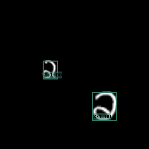
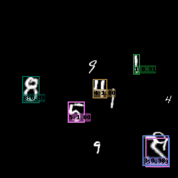
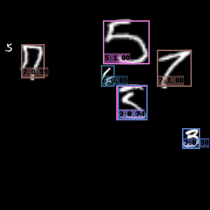
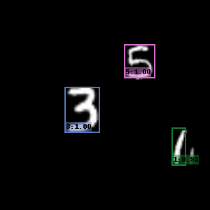
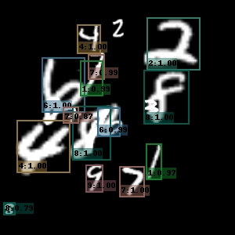
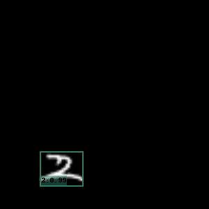
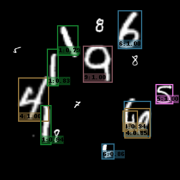
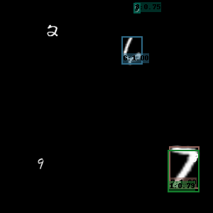
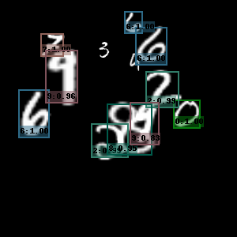
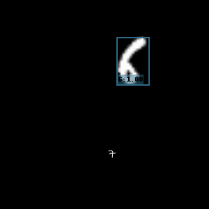
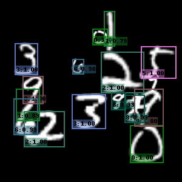
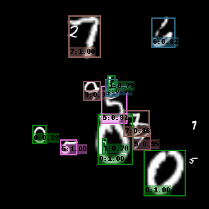
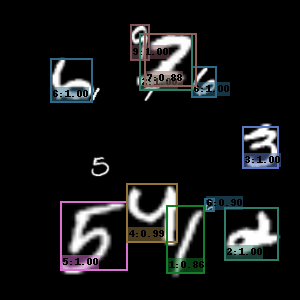
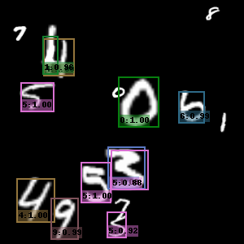
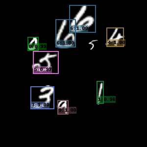

We see that many numbers are being correctly classified, but the model has some trouble with detecting the smaller-sized numbers.

## Task 4f)

FILL IN ANSWER.
