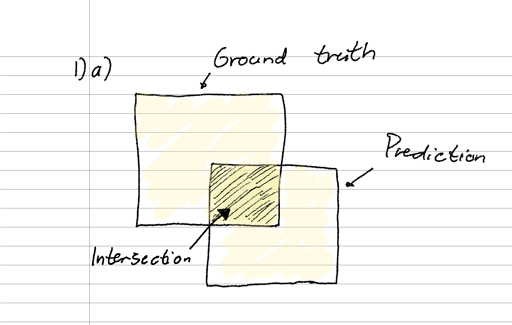
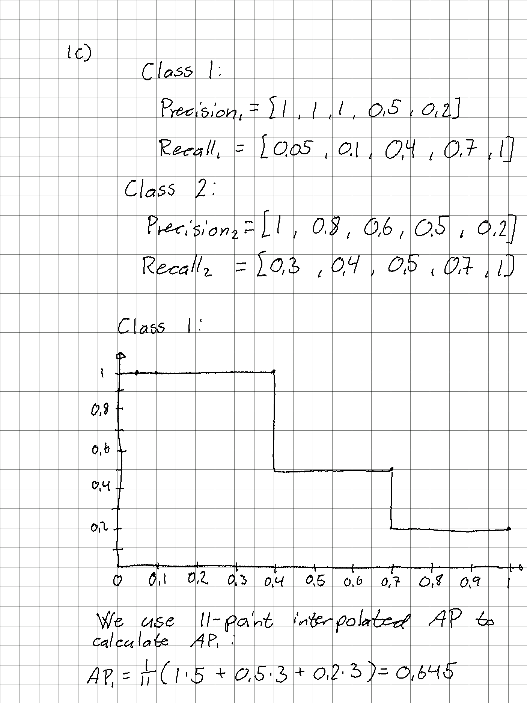
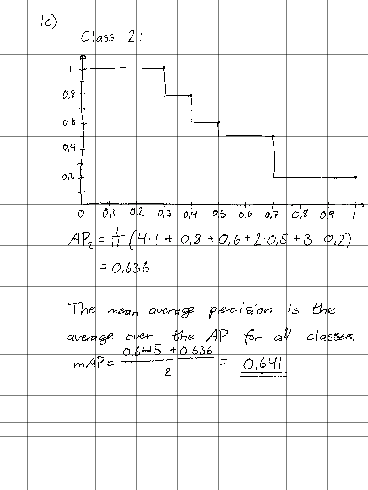
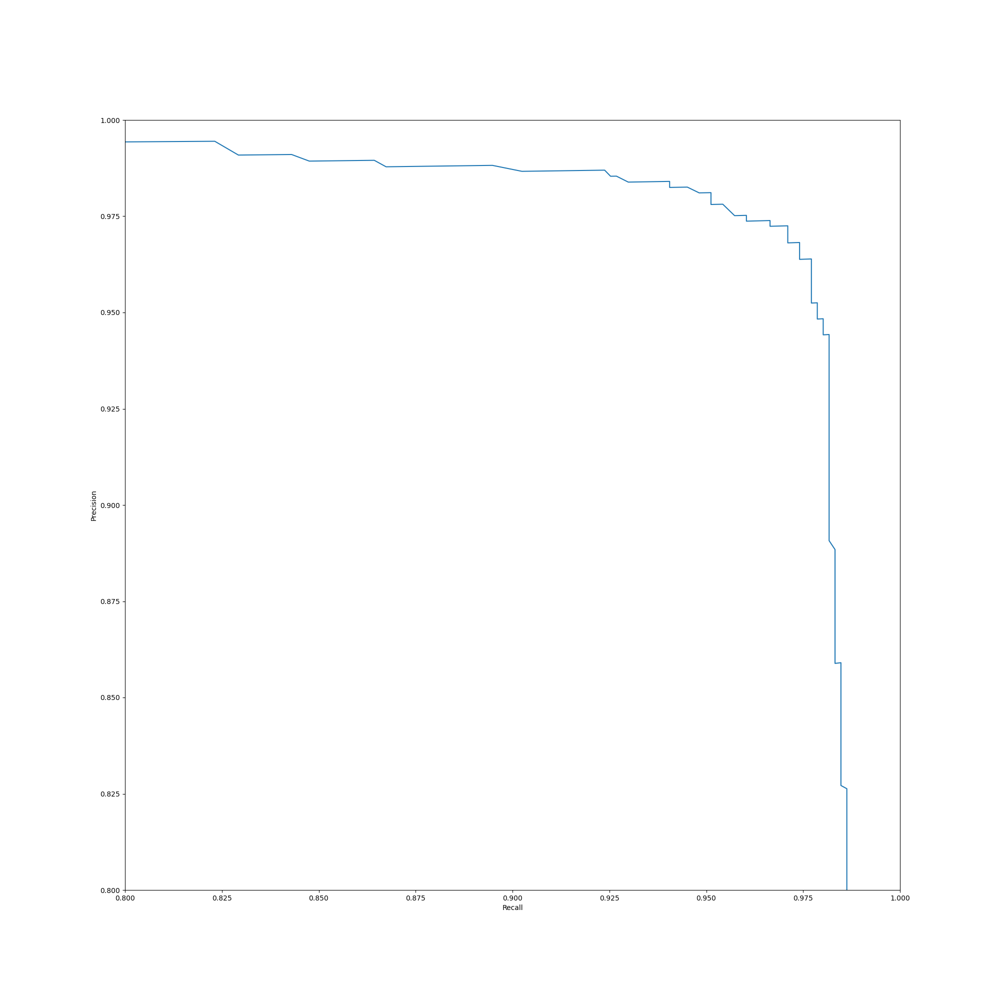
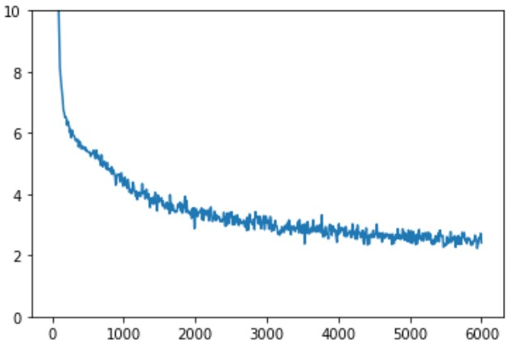

# Task 1

## task 1a)

Insersection over union (IoU) measures how much two rectangles (bounding boxes) overlap. That is, we measure how much of the prediction overlaps with the ground truth. It is calculated by the formula $IoU=area of overlap / area of union$. If there is no overlap then IoU is 0, while if we have 100 % correct prediction the IoU is 1. The area of union is always >= than area of overlap. Union is both rectangles combined.

## task 1b)

$Precision = TP / (TP + FP)$

$Recall = TP / (TP + FN)$

- TP = true positive
- FP = false positive
- TN = true negative
- FN = false negative

A true positive is a correct prediction that an object is there, while a false positive is an incorrect prediction that an object is there (predicted that the object is there, when in reallity it is not).

## task 1c)

The mean average precision (mAP) is the average of the average precision (AP). Thus, it is the total average of the average, where the AP is calculated once for each class.

# Task 2

### Task 2f)

# Task 3

### Task 3a)

From the SSD blog: "SSD uses **non-maximum suppression** to remove duplicate predictions pointing to the same object". Thus, the filtering operation is called non-maximum suppression.

### Task 3b)

**False**. "SSD uses lower resolution layers to detect larger scale objects. For example, the 4×4 feature maps are used for larger scale object". So, the deeper we go, the larger the detected objects are.

### Task 3c)

It uses different aspect ratios at the same location because it must detect different classes which have different aspect ratios. For example, a person is most likely tall and narrow, while a car is often shorter and wider, so if the bounding boxes have similar aspect ratios the model will not perform.

### Task 3d)

<!-- TODO -->

<!-- In SSD, the boundary boxes are chosen manually, while YOLO uses k-means clustering on the training dataset to determine the default boundary boxes. -->

### Task 3e)

$38*38*6=8664$

Each cell (anchor location) has 6 different anchors, and we have 38x38 such cells/anchor locations, resulting in 8664 anchor boxes for this feature map.

### Task 3f)

Following the reasoning from the task above calculate the number of anchor boxes for each feature map and sum them to get the total number of anchor boxes for the entire network.

$38*38*6=8664$  
$19*19*6=2166$  
$10*10*6=600$  
$5*5*6=150$  
$3*3*6=54$  
$1*1*6=6$

$8664+2166+600+150+54+6=11640$ total anchor boxes.

# Task 4

## Task 4b)

The screenshot is taken from the `plot_scalars.ipynb` notebook.

mAP: 0.7575

## Task 4c)

FILL IN ANSWER.

## Task 4d)

FILL IN ANSWER.

## Task 4e)

FILL IN ANSWER.

## Task 4f)

FILL IN ANSWER.
